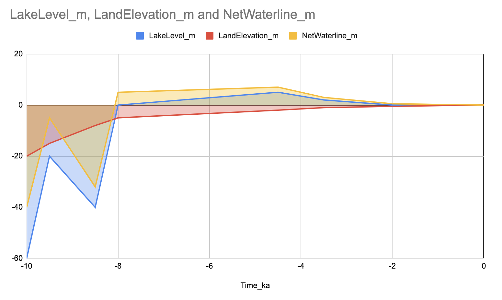
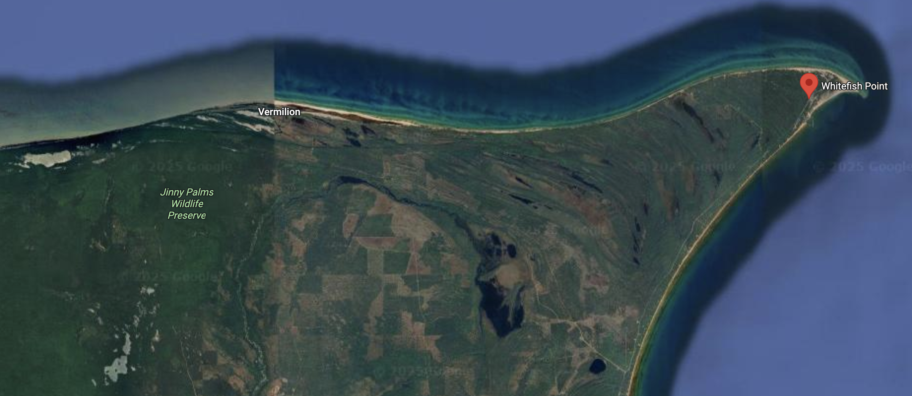
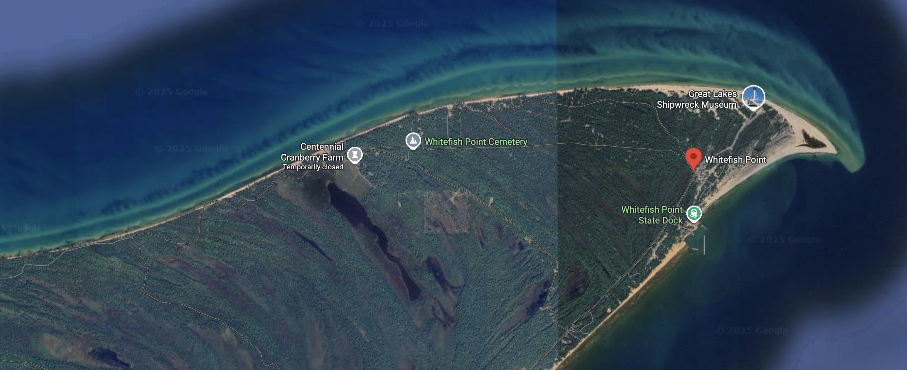
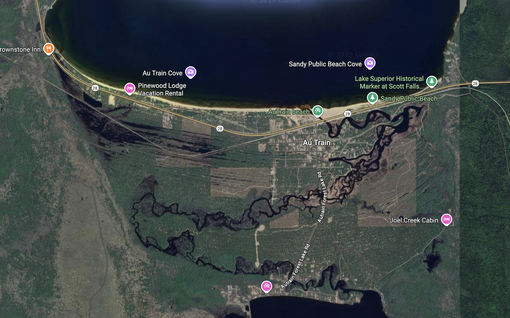
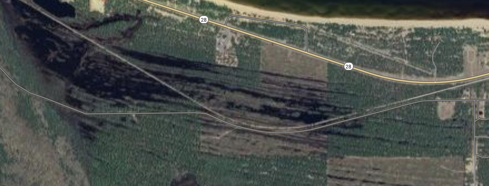

# Copper Harbor Holocene Water / Land History

## Columns

- Time_ka: Thousands of years before present (negative = past, 0 = now)

- LakeLevel_m: Lake surface relative to today's lake level at Copper Harbor (m)

- LandElevation_m: Ground elevation at the Copper Harbor site relative to today's ground elevation (m)

- NetWaterline_m: LakeLevel_m − LandElevation_m (positive = site underwater; negative = site above water)

## Table (story form)

| Time (ka) | LakeLevel_m | LandElevation_m | NetWaterline_m | Interpretation                                                                                       |
|-----------|-------------|-----------------|----------------|------------------------------------------------------------------------------------------------------|
| -10.0     | -60         | -20             | -40            | Lake far below today; land still strongly depressed but higher than lake. Shoreline well below site. |
| -9.5      | -20         | -15             | -5             | Lake rises fast, land rebounds fast. Shoreline approaches the site.                                  |
| -8.5      | -40         | -8              | -32            | Outlet drop lowers lake again; land still rebounding. Shoreline well below site.                     |
| -8.0      | 0           | -5              | 5              | Rapid transgression: lake at ~modern, land still 5 m low. Shoreline at/above site.                   |
| -4.5      | 5           | -2              | 7              | Local Nipissing highstand: lake ~5 m above today, land still ~2 m low. Shoreline well above site.    |
| -3.5      | 2           | -1              | 3              | Lake falling, land catching up. Shoreline above site.                                                |
| -2.0      | 0           | -0.5            | 0.5            | Lake ~modern, land ~0.5 m low. Shoreline slightly above site.                                        |
| 0.0       | 0           | 0               | 0              | Today reference point. Shoreline at site level.                                                      |

## Google Sheet

<https://docs.google.com/spreadsheets/d/e/2PACX-1vQ3w9vGGGwziYL_JlI85qNs-CEVNtKKOjWlsGf2qL1yHq_Z-UAIy0xXzQSgvlX9PjtBMpQ5bzR4iXNF/pubchart?oid=1206043460&format=interactive>

## Google Maps

<https://www.google.com/maps/place/Whitefish+Point,+MI+49768/@46.7351869,-85.103796,14597m/data=!3m1!1e3!4m6!3m5!1s0x4d484a6e32720f39:0x382ca3a47deea5b4!8m2!3d46.7658572!4d-84.9653567!16s%2Fm%2F049z_4j?entry=ttu&g_ep=EgoyMDI1MTAyMi4wIKXMDSoASAFQAw%3D%3D>

<https://www.google.com/maps/place/Whitefish+Point,+MI+49768/@46.7624682,-84.9950116,4678m/data=!3m1!1e3!4m6!3m5!1s0x4d484a6e32720f39:0x382ca3a47deea5b4!8m2!3d46.7658572!4d-84.9653567!16s%2Fm%2F049z_4j?entry=ttu&g_ep=EgoyMDI1MTAyMi4wIKXMDSoASAFQAw%3D%3D>

<https://www.google.com/maps/place/Whitefish+Point,+MI+49768/@46.4264756,-86.8438177,4962m/data=!3m1!1e3!4m6!3m5!1s0x4d484a6e32720f39:0x382ca3a47deea5b4!8m2!3d46.7658572!4d-84.9653567!16s%2Fm%2F049z_4j?entry=ttu&g_ep=EgoyMDI1MTAyMi4wIKXMDSoASAFQAw%3D%3D>

<https://www.google.com/maps/place/Whitefish+Point,+MI+49768/@46.4319437,-86.8584474,2643m/data=!3m1!1e3!4m6!3m5!1s0x4d484a6e32720f39:0x382ca3a47deea5b4!8m2!3d46.7658572!4d-84.9653567!16s%2Fm%2F049z_4j?entry=ttu&g_ep=EgoyMDI1MTAyMi4wIKXMDSoASAFQAw%3D%3D>

