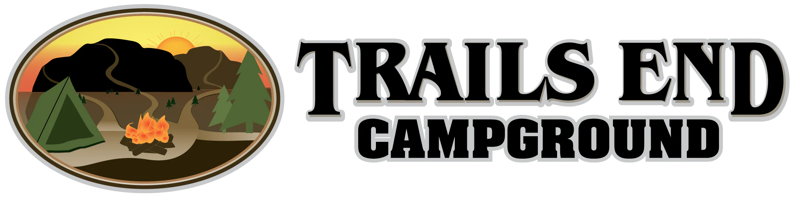
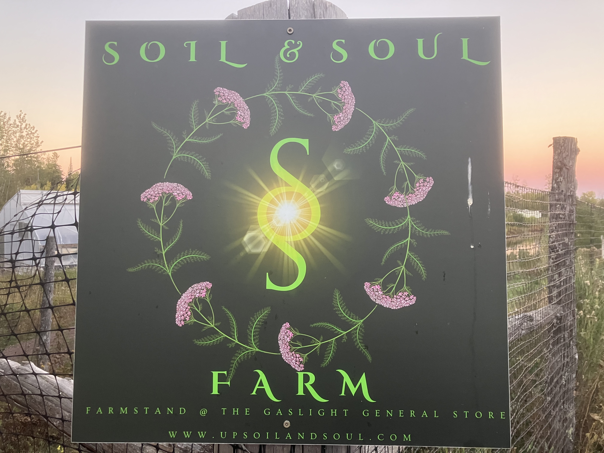
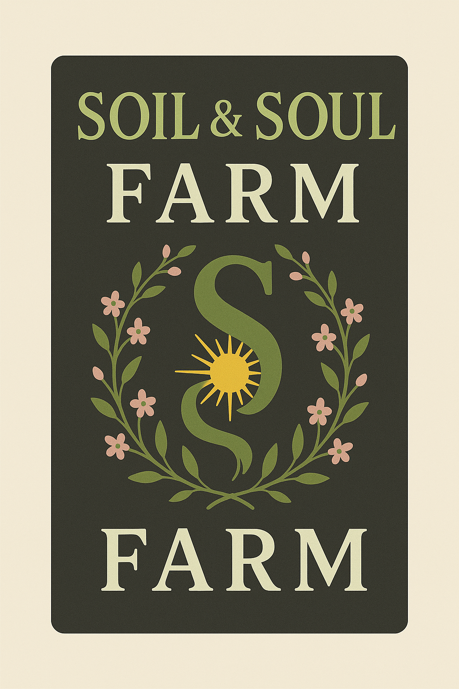
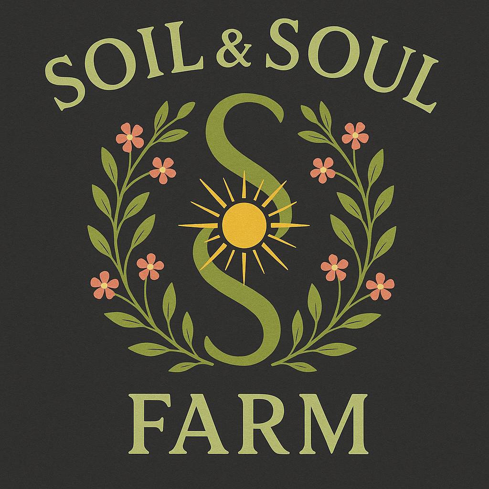

# Logos

## Trails End Campground Logo

### Trails End Description

The Trails End Campground logo features a horizontal design combining an illustrated emblem with bold text. The left side contains an oval-shaped emblem depicting a scenic camping scene with a tent and glowing campfire in the foreground, surrounded by pine trees and rolling hills. In the background, silhouettes of bison traverse the landscape beneath mountain ridges, while a warm sunset in shades of orange and yellow fills the sky. The emblem is framed with multiple borders in earthy tones.

The right side displays "TRAILS END" in large, bold uppercase letters with a white outline, stacked above "CAMPGROUND" in similar styling. The text has a rustic, outdoor aesthetic that complements the illustrated scene. The logo was created on April 6, 2021.

### Trails End ChatGPT Variations

- Version 1

- Version 2

## Soil & Soul Farm Logo

### Soil & Soul Description

The Soil & Soul Farm logo features a vertical dark gray rectangular sign with elegant typography and a central emblem. The top displays "SOIL & SOUL" in bright light green serif lettering, while "FARM" appears below in the same style but larger.

The central design element is a large, stylized green 'S' with a brilliant yellow and white sunburst radiating from its center, suggesting energy and growth. This is encircled by a delicate wreath of green stems and leaves adorned with clusters of small pink flowers, creating a natural, organic frame.

Below the main text, additional information appears in smaller light green sans-serif font: "FARMSTAND @ THE GASLIGHT GENERAL STORE" and the website "WWW.UPSOILANDSOUL.COM." The logo conveys a connection between earth (soil) and spirit (soul) through its botanical elements and radiant central symbol.

### Soil & Soul ChatGPT Variations

- Version 1

- Version 2

